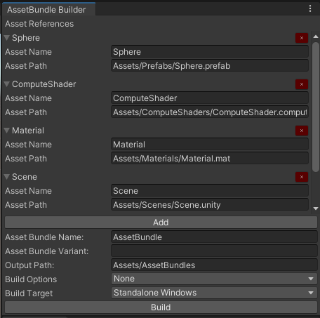

# **_Asset Bundle Tools_**

### **_Asset Bundle Builder_**

### _Description_
The Asset Bundle Builder Editor assist you in creating Asset Bundles.

### _Usage_
- Click "Add" to add Asset References
- Set the Asset References Asset Name and Path to the Asset
- Set the Asset Bundles Name
- Set the Asset Bundles Variant, leave empty if not required
- Set the Asset Bundles Output Path
- Select Build Options
- Select Build Target